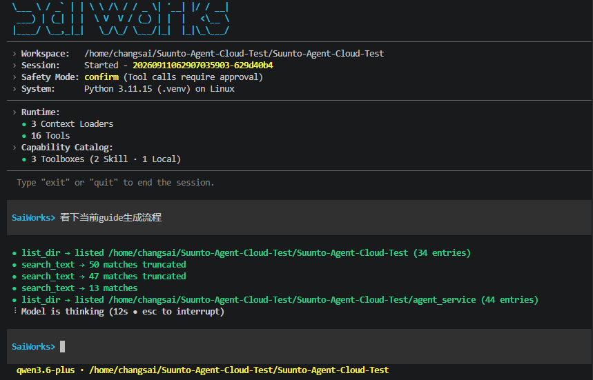
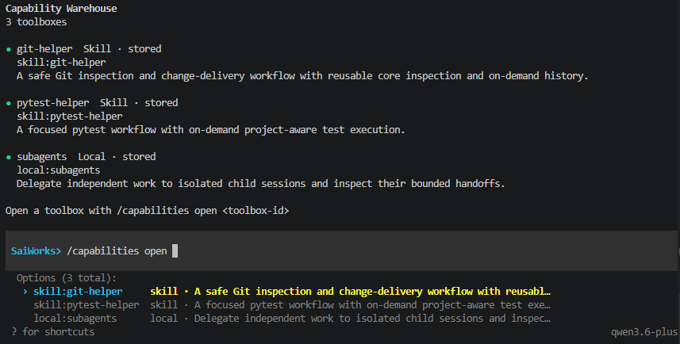
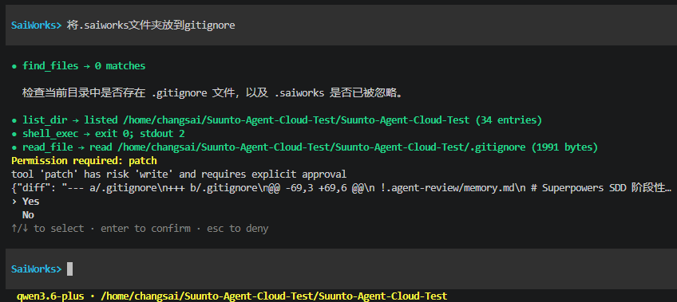

# SaiWorks

SaiWorks is an execution-centric Agent Runtime / Harness designed for reliable, permission-aware and recoverable AI execution.

The model proposes actions; SaiWorks checks constraints and permissions, executes capabilities, and records results and evidence. The current implementation primarily serves local coding tasks through CLI/TUI, with sessions, approval and recovery mechanisms. The broader Execution Platform is a target architecture, not a claim of completed capabilities.

## Architecture

SaiWorks is the Execution Core in a **2 Core + 1 Shell + 1 Shared Trust Domain** architecture. Model Core evolves independently as the Intelligence Fabric. CLI, TUI and future Desktop/IDE/API interfaces are interaction shells; shared identity, access and connectivity semantics form the Trust Domain.

Current CLI/TUI share the execution engine, while some session and run coordination still lives in the CLI. A complete shell-independent Runtime interface remains an evolution goal.

## Documentation Map

[文档入口](docs/README.md)维护阅读路径、专题归属和状态说明。

| 文档 | 职责 |
| --- | --- |
| [总体架构](docs/architecture.md) | 最新定位、目标责任和状态所有权 |
| [当前实现](docs/implementation.md) | 已有机制、代码依据和目标差距 |
| [演进路线](docs/roadmap.md) | 依赖、优先级和验收条件 |
| [运行时机制](docs/runtime/README.md) | 执行、能力、授权、工作空间、证据与恢复 |
| [接入机制](docs/integrations/README.md) | MCP、Skill、扩展点和模型调用侧边界 |
| [交互壳](docs/interfaces/README.md) | 壳与内核边界、CLI/TUI 专项 |
| [设计地图](docs/design/README.md) | 待实现设计、旧基线和探索材料 |
| [配置参考](docs/reference/configuration.md) | 运行配置与环境变量 |

使用从本页及配置参考开始；理解架构按“总体架构 → 当前实现 → 演进路线”阅读。目标设计不代替当前契约，版本与历史快照不代表最新实现状态。

## Project Layout

```text
src/saiworks/
  config.py         Runtime configuration and .env loading
  interaction/     CLI input/output
  orchestration/   session state and agent loop
  model/           LLM prompt, parser, adapter, and protocol
  sessions/        Stored conversation persistence
  tools/           executable tool registry
  safety/          guardrails and policy checks
  observability/   logging and event capture
```

## Quick Start

Requirements: Python 3.11 or newer.

Create a project-local virtual environment and install `SaiWorks` in editable
mode:

```bash
python3 -m venv .venv
.venv/bin/python -m pip install -e .
```

The installed command is `sai-works`; the Python module is `saiworks`.

Run a single request:

```bash
.venv/bin/sai-works --once "summarize this repository"
```

Single-request mode also creates and closes a persisted session, so delegated
subagent work and later `--resume` use the same session contract as interactive mode.

When developing without an editable install, use the source-tree form:

```bash
PYTHONPATH=src python3 -m saiworks --once "summarize this repository"
```

The current implementation supports a structured local tool loop for file
inspection, search, shell execution, patching, test commands, read-only Git
inspection, Skill activation, and on-demand MCP tool activation.

Long conversation mode:

```bash
PYTHONPATH=src python3 -m saiworks
```

启动后会显示当前工作区、会话、安全模式和已加载能力：



Interactive users can inspect the same warehouse with `/capabilities`, or activate one Skill through
the same path with `/skill <name>`; these commands do not maintain a separate capability state.
能力仓库支持渐进式打开工具箱，在不把全部工具暴露给当前会话的前提下提供需要的能力：



List saved conversations:

```bash
PYTHONPATH=src python3 -m saiworks --list
```

Choose a saved conversation interactively:

```bash
PYTHONPATH=src python3 -m saiworks --resume
```

Resume the most recent conversation:

```bash
PYTHONPATH=src python3 -m saiworks --last
```

Resume a specific conversation by id:

```bash
PYTHONPATH=src python3 -m saiworks --resume 20260331041240862413-588cbf9b
```

Single turn only:

```bash
PYTHONPATH=src python3 -m saiworks --once "summarize this repository"
```

Add explicit context files, directories, or globs:

```bash
PYTHONPATH=src python3 -m saiworks --context README.md --context "docs/*.md" "summarize these docs"
```

At the start of each run, `SaiWorks` also injects bounded context from
project `AGENTS.md` rules, common project markers, git status, and a compact
workspace tree.

Choose a safety mode:

```bash
PYTHONPATH=src python3 -m saiworks --mode readonly "summarize this repository"
PYTHONPATH=src python3 -m saiworks --mode confirm "edit a file after approval"
PYTHONPATH=src python3 -m saiworks --mode auto "apply low-risk file edits automatically"
```

## Connect To An OpenAI-Compatible Endpoint

Start your OpenAI-compatible endpoint and configure the `.env` file in the
`SaiWorks` source tree with its base URL:

```env
SAIWORKS_MODEL_BASE_URL=http://127.0.0.1:3000
SAIWORKS_MODEL_NAME=gpt-5.4
SAIWORKS_MODEL_TIMEOUT=60
SAIWORKS_MODEL_STREAM_MAX_SECONDS=900
SAIWORKS_MODEL_STREAM=false
SAIWORKS_MODE=confirm
```

Behavior:

- `SaiWorks` automatically loads `.env` beside the source checkout; an arbitrary
  target workspace's `.env` is not loaded automatically
- If `SAIWORKS_MODEL_BASE_URL` is still not set, `SaiWorks` keeps using `StubModelClient`
- If `SAIWORKS_MODEL_BASE_URL` is set, `SaiWorks` sends requests to `POST /v1/chat/completions`
- `SAIWORKS_MODEL_TIMEOUT` defaults to 60 seconds. It is the total timeout for JSON responses and the connection,
  first-byte, and inactivity timeout for SSE; active SSE traffic refreshes the inactivity window.
- `SAIWORKS_MODEL_STREAM_MAX_SECONDS` is the independent SSE wall-clock safety limit and defaults to 900 seconds.
- `SAIWORKS_MODEL_STREAM=true` enables OpenAI-compatible SSE transport. Deltas may be observed as they arrive,
  and interactive terminals render only projected natural-language fields as they arrive. Tool calls remain buffered;
  the orchestration loop receives one fully assembled and validated reply.
- `python -m saiworks --stream` enables the same behavior for one invocation; `--no-stream` overrides an enabled
  environment setting.
- `SAIWORKS_MODE` controls tool safety and defaults to `confirm`
- The configured endpoint remains responsible for its upstream credentials and provider-specific authentication
- The real-model path now supports tool-call loops: the model can request built-in tools, receive tool results, and continue until it produces a final answer
- Each run automatically writes observability logs under `.saiworks/runs/<timestamp>/`, including `events.jsonl` and a layered `details.log`

## Configuration

模型连接信息继续放在 `.env`；运行策略和 MCP 服务放在 `~/.saiworks/config.toml` 或项目的
`.saiworks/config.toml`。项目配置覆盖全局同名项。完整示例、参数中文说明和内部硬上限见
[配置参考](docs/reference/configuration.md)。

Run:

```bash
.venv/bin/sai-works "summarize this repository"
```

If you pass an initial prompt without `--once`, `SaiWorks` answers that prompt and then stays in interactive conversation mode. Type `exit` or `quit` to leave.

Interactive conversations are saved under the package/source checkout's
`.saiworks/sessions/` directory; this is not the active target workspace when
the two differ. Use `--list` to inspect saved session ids,
`--resume <session_id>` to continue a specific conversation, or `--last` to
reopen the most recently updated one.

If you prefer interactive selection, run `PYTHONPATH=src python3 -m saiworks --resume` without an id and pick a numbered session from the list.

For bash completion of `SaiWorks` flags, source [`contrib/sai-works-completion.bash`](contrib/sai-works-completion.bash) from the repository root:

```bash
source contrib/sai-works-completion.bash
```

## Core Tools

The built-in tool set exposes structured schemas, risk levels, stable error
codes, and workspace-bounded path handling:

- `list_dir`, `read_file`, `file_info`: read-only workspace file inspection
- `workspace_open`: explicitly switch the active workspace directory for the current session
  (see [session workspace lifecycle](docs/runtime/workspace.md))
- `find_files`, `search_text`: bounded file and text search
- `git_status`, `git_diff`: high-frequency read-only Git inspection
- `shell_exec`: execute a command in the workspace
- `patch`: apply a validated unified diff in the workspace
- `warehouse_list`, `toolbox_open`, `capability_activate`,
  `capability_release`, `capability_status`: inspect and manage on-demand
  Skill/MCP capabilities

Specialized workflow tools are progressively disclosed: `pytest-helper` supplies `run_tests`, while
`git-helper` adds Git workflow instructions and the lower-frequency `git_show` tool. Open and activate
those Skill toolbox leaves when the task needs them; `/skill <name>` activates the complete workflow for
interactive use. Tool providers remain the implementation owners; Skills group and recommend reusable
capabilities rather than defining whether a core tool exists.

写入操作会在执行前展示变更摘要并要求显式确认：



### Shell 会话与中断

每个交互会话最多维护一个串行的 Bash 会话，以保留工作目录和环境变量。
在 POSIX/Linux 环境中，该 Bash 在独立进程组中运行：正常退出、输入阶段的 Ctrl+C、
执行阶段的 Ctrl+C 以及命令超时时，SaiWorks 会终止整个进程组，而不是只终止 Bash
主进程。因此由该会话启动的普通后台子进程也会一并停止。超时后会立即重置为干净的
Bash，后续命令继续在该新 Bash 中执行。
完整的终止时机、并发边界和安全边界见
[Shell 会话生命周期](docs/runtime/shell.md)。

这是一种进程生命周期管理机制，不是操作系统级沙盒：命令仍以启动 SaiWorks 的用户
权限执行。对不可信代码或需要限制文件、网络和资源访问的任务，应在容器或系统级
沙盒中运行 SaiWorks。

Concrete tool implementations live under `src/saiworks/tools/builtins/`.
Each built-in tool is described in its own module and exported through a
`tool()` factory. Shared helpers for schema creation, workspace path resolution,
process execution, and output clipping live in `src/saiworks/tools/shared.py`.
`src/saiworks/tools/builtin_provider.py` supplies built-ins to application composition and owns the
standalone registry factory used by tests; there is no parallel legacy assembly path.

Risky tools such as `shell_exec` and `patch` require interactive approval in
the default `confirm` mode before execution. In `readonly` mode only read tools
can run. In `auto` mode read and write tools can run without confirmation while
execute, test, network, and destructive actions still require approval. Dangerous
shell commands such as `rm -rf`, `git reset --hard`, and `git clean -fd` are
classified as destructive. If the same successful tool call is requested again
within one run, the orchestration layer skips the duplicate instead of asking for
approval and executing it again.

The model ends a run by returning `done: true`. There is no separate `finish` tool.

## Development

Create a project-local virtual environment and install the package plus test
dependencies:

```bash
python3 -m venv .venv
.venv/bin/python -m pip install -e . pytest
```

Run the test suite:

```bash
PYTHONPATH=src .venv/bin/python -m pytest -q
```
