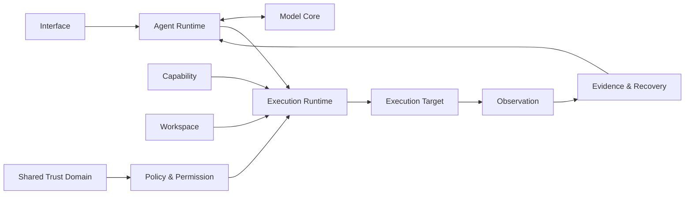

# SaiWorks 总体架构

状态：**目标架构基线**，更新于 2026-09-30。本文定义定位、职责、依赖方向和状态所有权，不宣称目标能力已经实现。代码现状见[当前实现](implementation.md)，演进顺序见[路线图](roadmap.md)。

## 1. 定位与责任

SaiWorks is an execution-centric Agent Runtime / Harness designed for reliable, permission-aware and recoverable AI execution.

SaiWorks 是 Execution Core。模型负责提出意图、计划与动作建议；SaiWorks 负责依据授权和约束裁决、执行，并保存可检查的结果与证据。运行时不以模型自述代替执行事实，也不承诺所有现实操作都可回滚或被完全验证。

核心资产是执行语义、执行安全、执行状态、执行证据和执行恢复。Coding 是当前主要场景，不是内核的长期领域边界。

## 2. ChangsAI 系统边界

体系采用 **2 Core + 1 Shell + 1 Shared Trust Domain**。

| 组成 | 责任 | 不应持有的责任 |
| --- | --- | --- |
| SaiWorks / Execution Core | Agent 与任务运行、动作执行、授权门禁、验证、证据和恢复 | 推理资源部署、GPU 调度和模型平台计量 |
| Model Core / Intelligence Fabric | 模型、Provider、Backend、Compute Resource、推理部署、路由、调度和计量 | 现实动作执行、工作空间授权和任务完成裁决 |
| Interface | CLI、TUI、Desktop、IDE、API 等输入、展示和交互适配 | 核心执行状态、独立策略与恢复逻辑 |
| Shared Trust Domain | 身份、设备、凭据、访问权限、票据、连接和访问审计语义 | 替代执行策略或把资源可访问性等同于动作许可 |

Model Core 已在其他仓库独立演化。本仓库维护调用侧需求和适配，不复制其内部架构。共享信任域先作为共享领域与协议边界存在，不预设独立 access-core 服务或仓库。

## 3. 协作关系

```text
CLI / TUI / Desktop / IDE / API
                 |
       SaiWorks 交互边界
                 |
        Execution Core <----> Model Core
                 |
       执行门禁 / 执行适配
                 |
    Local / Remote / Cloud / Device

Shared Trust Domain 为访问边界提供身份、凭据与连接语义；
执行权限由 SaiWorks 在这些事实基础上继续检查。
```

远程机器可以同时是 SaiWorks 的 Execution Target 和 Model Core 的 Compute Resource。连接身份可以关联，但执行权限、推理额度、调度和生命周期分别管理。能够访问机器不代表可以执行任意命令或使用全部 GPU。

同进程组件优先使用语言级接口；跨进程、跨设备或信任边界再增加传输协议。模块边界不等于必须拆服务。

## 4. SaiWorks 六个目标领域

以下是职责划分，不是已经完成的模块拆分，也不是已冻结的六组 API。

| 领域 | 核心问题 | 状态与职责 |
| --- | --- | --- |
| [Agent Runtime](runtime/agent-runtime.md) | Agent 如何持续工作 | Agent、Task、Run、Turn、上下文、预算、子代理、干预与运行生命周期 |
| [Execution Runtime](runtime/execution-runtime.md) | 动作如何在约束下生效 | 动作提案、执行门禁、Executor、Execution Target、观察与结果 |
| [Capability](runtime/capability.md) | 有什么能力、何时可用 | 能力目录、操作描述、来源、按需激活和释放；工具是执行适配形式 |
| [Workspace](runtime/workspace.md) | 在什么资源环境中工作 | 资源、环境、仓库、授权范围、会话与证据的关联；不局限于 cwd |
| [Policy & Permission](runtime/policy.md) | 谁可以对什么执行什么 | 基于主体、动作、能力、资源、目标、风险和上下文作出执行决定 |
| [Evidence & Recovery](runtime/evidence-recovery.md) | 如何证明与继续执行 | 检查点、验证证据、历史关联、恢复与副作用协调 |

工作流与调度按运行和执行职责归属，不建立第二套完成状态。能力发现、激活、授权、目标选择和执行分别负责不同阶段；发现或激活能力不自动授予执行许可。Agent 逻辑属于 Runtime，不能藏入工具而绕过预算、审批、状态和审计。

## 5. 执行闭环

目标领域围绕同一条执行链协作，各自拥有状态与约束：




```text
用户意图 → 运行与上下文 → 模型动作提案 → 结构校验
         → 策略与授权 → 执行 → 观察 → 验证与证据
         → 检查点 → 继续 / 重试 / 恢复 / 请求人介入
```

运行时根据执行事实、约束与证据计算任务状态；模型声明完成只是输入。失败后的自动恢复不得扩大原有授权。不可确定是否已生效的动作需要核对现实状态，不能仅依赖模型重试。

恢复是从已保存事实继续；重放可能再次产生副作用；回滚依赖具体执行目标的补偿能力。三者不能因为存在日志或检查点而视为等价。

## 6. 状态所有权

| 状态 | 目标权威所有者 | 其他组件的角色 |
| --- | --- | --- |
| 任务、运行、完成条件和执行检查点 | SaiWorks Runtime | 壳展示，模型接收有界投影 |
| 动作许可与授权范围 | SaiWorks Policy，引用共享信任事实 | 壳提交人的决定，工具执行约束 |
| 能力目录与激活集 | SaiWorks Capability | 接入源提供描述与执行适配 |
| 工作空间运行关系 | SaiWorks Workspace | 壳选择和展示，不重新定义执行范围 |
| 执行结果、证据和恢复关联 | SaiWorks Runtime | 存储持久化，日志提供诊断 |
| 模型部署、推理资源和平台路由 | Model Core | SaiWorks 表达需求并消费结果 |
| 身份、凭据、访问票据和连接 | Shared Trust Domain 对应实现 | 两个 Core 消费可验证的访问事实 |

这是逻辑所有权，不要求每行一个服务。当前存储、日志和 CLI 的具体归属见[当前实现](implementation.md)。

## 7. 壳与内核边界

所有交互壳应复用相同运行语义。提交与控制运行、会话恢复、事件观察、授权交互、工作空间与能力查询、执行证据查看，是需要梳理的交互职责，并非已经存在的标准接口数量。

当前缺口和设计约束见[壳与内核边界](interfaces/runtime-boundary.md)。本基线不新增字段、错误码或传输协议；具体契约需经过单独设计与兼容性确认。

## 8. 文档与演进

[运行时机制](runtime/README.md)定义已有机制，[接入机制](integrations/README.md)维护来源与适配，[设计地图](design/README.md)区分待实现和探索。旧 Three Plane / Seven Layer 材料不再定义本项目总体架构。

先形成可靠的本地 Runtime 与清晰壳边界，再验证 Execution Platform；分布式运行按真实部署、生命周期与信任需求演进，不以远期愿景倒推当前服务数量。
