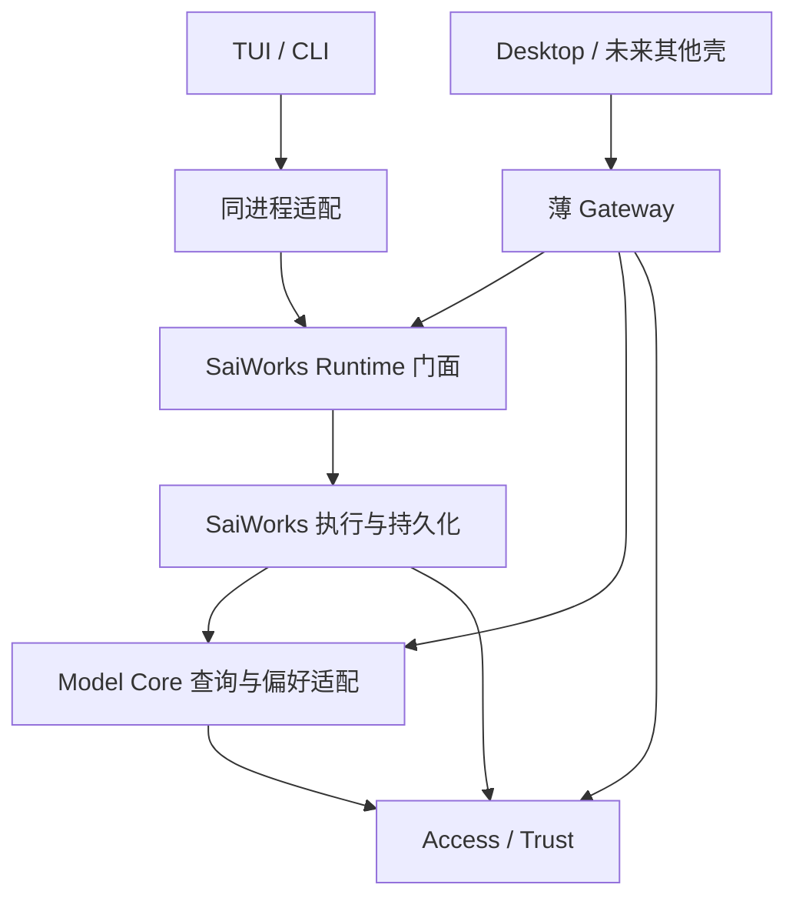

# 壳与内核边界设计

- 日期：2026-09-30
- 状态：首版行为决策已确认，待实施与验证；不是已发布接口契约。
- 范围：TUI/CLI 解耦、未来 Companion、薄 Gateway 与两核的边界。
- 原则：Contract first 不等于 Schema first；先确定行为、权威状态和故障语义。
- 本设计不发布网络接口。B/C 已按确认后的独立接受记录契约实施；具体实现见阶段核对。后续契约变更必须说明影响并确认。

## 1. 目标与非目标

让同一执行能力可由 CLI、TUI、Desktop 使用，让关闭客户端和 Gateway 重启不改变任务的执行语义。先用现有 TUI 验证边界，再增加桌面入口。

第一版不实现 Mobile、Voice、被动屏幕监控、远程设备调度或完整 Agent OS。不预设 HTTP、WebSocket 或 RPC，不为了统一让同进程客户端强制走网络。暂停/恢复不在首轮产品承诺中。

## 2. 拆分前已核对的现状（历史基线）

源码位置：`/home/changsai/testcode`（SaiWorks）；Model Core 当前实现位于相邻的 `/home/changsai/test` 仓库。本节保留拆分前的静态源码核对事实；拆分后的实现与测试证据见[阶段核对](shell-core-audit.md)。

SaiWorks 已有 [壳与内核边界](../interfaces/runtime-boundary.md)、[系统协议边界](protocol-boundaries.md)和 [TUI 说明](../interfaces/tui.md)。本草案补充它们尚未展开的常驻、同步与迁移语义，不替代现行领域契约。跨仓库相对链接依赖当前并列目录布局。

| 发现 | 源码依据 | 影响 |
| --- | --- | --- |
| 应用装配返回 CLI，并选择终端 Presenter | `src/saiworks/app.py`：create_app | 无终端客户端尚无独立运行装配入口 |
| 引擎已有独立进度抽象 | `orchestration/progress.py`：ProgressReporter | 可复用观察接点，不必重写执行循环 |
| 审批回调与进度接到 Presenter，Presenter 又持有引擎 | `app.py`：引擎装配 | 展示和运行控制仍有直接耦合 |
| CLI 协调会话保存、恢复、上下文压缩及结果归档 | `interaction/cli.py`：chat、persist_run、prepare_session_runtime | 运行职责需要从壳中提取 |
| CLI 捕获中断、构造中断总结并调用引擎内部收尾 | `interaction/cli.py`：_run_once | 终态收尾未完全由 Runtime 统一负责 |
| 无终端子任务仍通过返回 CLI 的工厂装配 | `app.py`、`interaction/cli.py`：run_background | 子任务也需迁移到独立运行装配 |
| TUI 队列、状态归约和 Renderer 已分开 | `interaction/tui.py`、`tui_events.py`、`tui_state.py` | 保留渲染与展示投影，不直接升级成权威状态或持久事件日志 |
| 引擎已有取消信号与检查点 | `orchestration/engine.py` | 有复用基础，不等于已具备跨进程取消和重连保证 |
| 显式上下文按请求路径在加载时读取 | `context/explicit.py` | 路径绑定不等于提交时内容冻结 |
| 当前 Model Core 桌面入口启动后端，并在退出时停止它 | Model Core 仓库 `desktop/main.cjs` | 是看板桌面壳，不是常驻 Companion Runtime |

结论：需要拆，但拆的是 CLI 中的运行协调和装配耦合；TUI 的输入、终端渲染、展示投影继续保留。

## 3. 组件职责与依赖

Runtime 门面属于 SaiWorks 的应用运行层，复用执行内核，不另建执行状态机。Gateway 是跨进程入口适配；Runtime Manager 是进程监督组件，负责实例发现、启动、健康检查和关闭，二者职责分开，初期可以一起部署。Manager 区分 managed 与 attached：只有自己启动并持有 ownership token 的进程才可停止；对 attached 实例只断开连接。多个入口默认连接已有健康实例，启动竞争必须通过实例锁或等价机制收敛到一个实例。Model Core 默认是可共享常驻服务，Desktop/TUI 退出不自动关闭它；SaiWorks 首版是单用户本地 Runtime，生命周期独立于 Shell。

| 组件 | 拥有的职责 | 边界 |
| --- | --- | --- |
| Shell | 输入、获准上下文采集、展示、选择、用户偏好 | 展示投影不决定完成、授权或恢复 |
| Gateway | 连接、认证接入、版本适配、转发、聚合查询 | 无任务重试、审批生命周期或业务恢复逻辑 |
| SaiWorks Runtime | 会话协调、任务控制、持久化协调、观察与查询入口 | 消费并组织已有执行领域机制 |
| SaiWorks 内核 | 执行、权限检查、checkpoint、结果与证据 | 每次现实执行独立检查资格 |
| Model Core | 模型资源、推理、路由、成本和隐私约束 | 不推进业务任务或执行工具 |
| Access / Trust | 身份、访问范围、有效性与撤销 | 身份认证与具体执行批准分开 |
| Runtime Manager | 服务进程生命周期、健康和运维 | 重启服务不能被当作重新提交任务 |

Gateway 重启后，任务仍由 SaiWorks 管理。Gateway 不可达时，客户端显示连接中断，不能据此宣布任务失败。

## 4. 权威状态与生命周期

任务、执行尝试、会话和客户端连接是不同生命周期。既有 Task/checkpoint、run、session 标识须先映射，不能把一次模型请求或一次客户端连接当成任务。

| 事实 | Authority |
| --- | --- |
| 任务状态、终态、结果、执行证据 | SaiWorks |
| 会话关联、恢复资格 | SaiWorks |
| 模型可用性、实际选择、推理用量 | Model Core |
| 当前活动文件、选区和采集时刻 | Shell / 上下文采集源 |
| 任务已接受的绑定上下文 | SaiWorks |
| 身份与访问资格 | Access / Trust |
| 待审批动作及决定能否用于当前执行 | SaiWorks，结合 Trust 资格检查 |
| 连接是否可用 | Gateway 与各客户端各自的连接观察 |

首版整个 Runtime 只有一个执行槽，不支持同一实例内多任务并发执行。同一 Session 按 FIFO 串行，一个 Session 同时最多一个 running task；阶段 B/C 不承诺跨 Session 并行。审批等待任务不占执行槽，同一 Session 的后续任务仍不能越过等待中的前序任务开始执行；其他 Session 可使用空闲执行槽。跨 Session 的队列公平性不构成首版并行承诺。现有子代理通过独立 Runtime 实例执行，单槽约束逐实例生效，不将父任务和子任务塞入同一个槽而造成同步委派死锁；本轮不承诺或新增跨实例调度器。

行为先串行，结构先隔离：每个 Task 持有独立 execution context、cancellation token、审批和工具运行状态。工具定义、身份及基础访问资格可共享；工具执行实例、调用状态和具体执行批准不得跨 Task 共享。批准绑定 Task + Action。Runtime 不以进程级共享取消标记或单份可变运行上下文作为最终结构；唯一终态收尾由运行层负责。

客户端关闭只结束观察。常驻模式下任务由独立运行服务持有；现有 CLI 的退出/中断行为保留到迁移验证完成，不能提前宣称已支持后台续跑。

SaiWorks 进程崩溃与客户端断开分开处理。checkpoint 存在不证明外部动作可安全重做；恢复先核对执行结果，未知结果明确保留，不能无条件重放产生副作用的动作。初期恢复可以需要显式选择，不承诺无人值守自动恢复。

## 5. 上下文绑定与会话连续性

Live Context 是壳当前看到的环境；Bound Context 是任务接受时固定的上下文。提交动作需要有明确接受点：Runtime 校验工作区和访问范围、绑定输入与上下文，Accepted 定义为：SaiWorks 已持久化稳定 Task Identity，并完成 Bound Context 元数据与 submission identity 的绑定和去重记录。三者构成一个一致的持久化接受结果，不能在部分写入后确认接受或启动执行。Accepted 与 Running 分离，接受后可以排队。客户端收到接受确认后才宣称任务已接受。

submission id 从首版作为内部概念存在。确认丢失时客户端使用同一 submission id 查询或重试提交，Runtime 返回原 Task；相同身份携带不同提交内容不得静默复用或创建第二个任务。未完成持久化的提交视为未接受，可重新提交；完成持久化但确认未送达的任务仍已接受。确认后崩溃，Task 必须仍可查询，继续执行或恢复须另行核对。提交去重不等于外部动作的恰好一次执行。

冻结的是工作区身份、用户输入、选区/剪贴板等提交内容，以及引用关系；不冻结整个文件系统。文件内容若需提交时保证，必须使用实际内容快照或可验证版本引用，不能只提交一个会变的路径。执行中读取最新文件需记录观察版本；恢复时核对变化。

新增上下文必须是显式补充操作，绑定到确定任务并留记录；前端切窗口不能替换既有绑定。规则和策略快照也不能覆盖实时权限撤销检查。

“刚才那个问题”通过会话、前序任务及结果关联解释。存在多个可能对象时需要澄清，不能静默选择当前窗口。已有会话历史可复用，但跨任务 lineage 尚需核实和设计。

## 6. 审批与取消

审批对象由 SaiWorks 产生，绑定具体动作、参数、任务、范围和有效性。壳显示动作并提交人的决定；Runtime 在执行前检查决定仍适用。重复点击、多客户端同时决定、过期决定和取消竞态必须有一致处理，Gateway 不缓存批准来替代内核判断。

审批等待与连接寿命分开。断开期间保留待审批状态；进入 WaitingApproval 前持久化 continuation/checkpoint，然后释放执行槽。默认不保留模型连接或工具进程；需要继续存在的外部长进程必须作为独立受管资源管理。审批等待不计执行预算和模型预算，单独计算 approval TTL。所有审批必须有有效期边界，TTL 数值由配置决定。审批过期仅使 Approval 失效，Task 保持可恢复的 WaitingApproval 状态，不自动执行、不默认使整个 Task 失败；重新请求审批或重新生成动作后才能继续。批准后重新排队、获取执行槽，并在执行前重新校验批准与权限。continuation 必须保留已消耗的执行时间、模型尝试数和其他任务预算；续跑不通过新建 Run 重置预算。在决定未到或不可校验时不执行对应动作。拒绝动作是否导致任务终止沿用已核实的执行政策，不由 UI 自行推断。

Cancel 优先于 Approval：取消一经 SaiWorks 接受，后续批准不得触发新动作；取消接受与动作启动必须在权威运行层有一致的排序点。已在取消接受前启动的动作进入停止与结果核对流程。取消请求被接受不等于执行已经停止。运行层停止新动作、传播中断、核对活动工具和推理，再产出权威结果。无法确认外部进程已停或动作结果时，不能显示“已安全回滚”。取消不撤销已经发生的副作用。

暂不暴露 Pause：停止新 step、等待当前工具结束、强制终止进程是不同能力，必须分别核实后才承诺。

## 7. 快照与事件同步

采用 Snapshot + monotonically increasing revision 的同步模型，不承诺完整持久事件日志。revision 在明确的权威状态范围内单调增加；快照及其 revision 来自同一个一致读取点。订阅与快照衔接必须能发现期间的变化，避免静默漏掉更新。

权威状态来自 SaiWorks。任务状态、审批、artifact、结果、错误和执行事实必须可恢复；通知用于观察变化，不强制采用事件溯源。高频文本 token preview 属于瞬态展示，不保证完整重放。

Runtime 提供一致快照和修订位置，Gateway 只转发。重复或旧通知可按所属状态范围与 revision 去重；乱序、修订缺口或无法补齐的通知触发重新获取快照。重连允许直接恢复最新快照，无需永久保存全部事件。不能把 TUI 当前有界展示队列当成权威记录。

慢客户端不得阻塞执行。可合并临时进度；状态变化、审批和终态无法继续交付时，必须明确要求重新同步，不能静默丢失正确状态。重连优先恢复权威状态，不承诺逐字恢复所有瞬态预览。

SaiWorks 拥有 artifact identity 与任务关联，实际内容可存于 workspace 或 object store；Shell 不得持有唯一副本。artifact 的恢复和查询不能依赖客户端仍然在线。

首轮需验证两个客户端观看同一任务；观看权限不自动包含取消或审批权限。

## 8. 用户偏好与能力表达

壳可表达本地限定、隐私边界、预算、延迟偏好和指定模型。Model Core 判断是否可满足并落实路由。不能把硬约束降为偏好；无法满足时明确告知。

Provider 传输、凭据池、后端重试属于基础设施。管理员看板可以管理这些资源，但 Companion 的任务提交不依赖这些实现细节。模型建议不会赋予工具执行权限。

## 9. 兼容性与待定项

现有 CLI、TUI、非 TTY、子任务及模型传输行为先保持兼容。先整理同进程门面，再按需要选择跨进程传输。服务健康报告分别表达 Model Core、SaiWorks 和连接状态，单一健康探针成功不等于所有任务能力可用。

已确认的行为决策按实施阶段落地：B/C 完成单执行槽、Task 隔离、持久化接受、提交去重、无终端运行和唯一收尾；D 完成 revision 同步、可恢复审批、TTL、等待释放执行槽、取消优先和观察/控制权限分离；E 完成实例发现、进程 ownership、Gateway 重启、崩溃恢复与部分就绪。

具体契约仍需明确：既有 Task/run/session 标识映射、上下文引用格式、revision 的状态范围、submission identity 的作用域与保留期限、权限接入、版本协商、记录保留与删除。后续字段、错误码和持久化格式变更应说明兼容性影响并确认；本文中的状态和身份名称表达行为概念，不提前发布 API。

实施路径与当前能力映射见 [实施计划](shell-core-migration.md)。Model Core 仓库的 [架构基线](../../../test/docs/model-core-architecture.md) 继续负责智能核心；其中 Interface 直连是逻辑消费关系，本草案的 Gateway 是可选入口适配，未修改现有接口。
